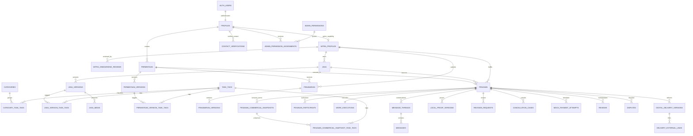
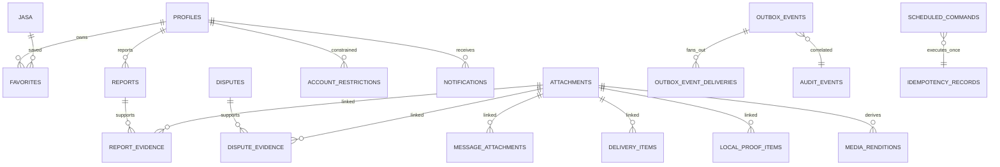

# Jasama Closed-Beta Database Schema

Status: logical PostgreSQL/Supabase schema contract. SQL migrations and generated types must conform to it.

## 1. Conventions

- Application primary keys are `uuid` with database-generated values.
- `auth.users.id` is referenced only by the base `profiles.auth_user_id`.
- Instants use `timestamptz`; scheduling contexts also store an IANA `timezone text`.
- Money uses non-negative `bigint` whole rupiah and `currency char(3) CHECK (currency = 'IDR')`.
- Mutable rows use `created_at`, `updated_at`, and optimistic `lock_version bigint`. Immutable rows use `created_at` only.
- Domain states use separate PostgreSQL enum/check domains. There is no generic workflow-status column or client-settable state API.
- `is_demo boolean NOT NULL DEFAULT false` is present on user-facing aggregate roots and propagated to their versions/children.
- `metadata jsonb` is permitted only where explicitly stated for non-core, forward-compatible annotations. Ownership, authorization, state, money, deadlines, terms, and evidence classification must be typed columns.
- Retention durations marked “policy pending” must not be hard-coded because OD-28/30/33 exact durations remain P2.

## Exact definitions for tables changed by final hardening

This section is authoritative where an older catalog row below uses shorthand.

### `profiles`

- Columns: `id uuid NOT NULL DEFAULT gen_random_uuid() PRIMARY KEY`; `auth_user_id uuid NOT NULL`; `display_name text NOT NULL`; `avatar_attachment_id uuid NULL`; `locale text NOT NULL DEFAULT 'id-ID'`; `timezone text NOT NULL DEFAULT 'Asia/Jakarta'`; `account_state account_state NOT NULL DEFAULT 'active'`; `is_demo boolean NOT NULL DEFAULT false`; `deactivated_at timestamptz NULL`; `created_at timestamptz NOT NULL DEFAULT now()`; `updated_at timestamptz NOT NULL DEFAULT now()`; `lock_version bigint NOT NULL DEFAULT 0`.
- Foreign keys: `auth_user_id → auth.users(id) ON DELETE RESTRICT`; `avatar_attachment_id → attachments(id) ON DELETE SET NULL`, added after both tables exist.
- Constraints/indexes: `UNIQUE(auth_user_id)`; nonblank bounded `display_name`; valid IANA `timezone`; indexes `(account_state)`, `(is_demo)`.
- Mutability/RLS: owner may change display name, avatar, locale, and timezone through a server command; state/demo/timestamps/version are server-controlled. Owner is `auth_user_id = auth.uid()`; public access uses a safe projection.
- Demo/retention/state: a demo profile forces every marker-bearing descendant to `is_demo=true`; pure join/history rows inherit demo classification through their required parent FK. Production insert/import guards reject the demo profile and recursively reject either form of descendant. Retention class `account`, exact duration pending OD-28. `account_state` owns machine 15.

### `admin_permission_assignments`

- Columns: `id uuid NOT NULL DEFAULT gen_random_uuid() PRIMARY KEY`; `profile_id uuid NOT NULL`; `permission_id uuid NOT NULL`; `scope_type admin_scope_type NOT NULL`; `scope_id uuid NULL`; `grant_source admin_grant_source NOT NULL`; `granted_by_profile_id uuid NULL`; `provisioning_change_ref text NULL`; `starts_at timestamptz NOT NULL DEFAULT now()`; `expires_at timestamptz NULL`; `revoked_at timestamptz NULL`; `reason text NOT NULL`; `created_at timestamptz NOT NULL DEFAULT now()`.
- Enum/FKs: `admin_grant_source` contains exactly `admin|provisioning`; recipient/grantor reference `profiles(id) ON DELETE RESTRICT`; permission references `admin_permissions(id) ON DELETE RESTRICT`.
- Admin-source checks: `grant_source='admin'` requires a nonnull grantor different from recipient, requires null `provisioning_change_ref`, and requires the grantor already hold active authorized permission-management capability for the scope. High-risk permission codes are rejected until verified reauthentication exists.
- Provisioning-source checks: `grant_source='provisioning'` requires null grantor and a nonblank `provisioning_change_ref`. Only reviewed migration/provisioning ownership may insert; application, user, and administrator roles receive no insert/execute grant for this path. It is limited to initial bootstrap or controlled recovery.
- Bootstrap prerequisite/idempotency: the exact target Auth account and active, non-demo `profiles` row must exist before provisioning. The reviewed change reference identifies that target and an exact permission/scope set. A unique expression index on `(provisioning_change_ref, profile_id, permission_id, scope_type, coalesce(scope_id, '00000000-0000-0000-0000-000000000000'::uuid))` makes exact replay idempotent. The provisioning transaction compares the complete existing set for the reference with the reviewed requested set and rejects additions, omissions, a different target, or reuse of the reference with a different set.
- Other constraints/indexes: unique active recipient/permission/scope tuple using nulls-not-distinct semantics; expiry after start; revoked assignment cannot be active. Indexes `(profile_id, revoked_at, expires_at)`, `(permission_id, scope_type, scope_id)`, `(granted_by_profile_id)` where nonnull, and `(provisioning_change_ref)` where nonnull.
- Audit/RLS/retention: every successful grant, denial, revoke, bootstrap, recovery, and idempotent replay result appends audit. Provisioning events use actor kind `system_provisioning` and record the safe change reference, exact target, permission codes/scopes, correlation, and outcome. Subjects may read their effective grants; authorized ordinary permission managers use the admin-source command; provisioning ownership bypass is unavailable to runtime roles. Retention class `authorization_audit`; rows are append-only except revocation/expiry lifecycle fields.

### `jasa_versions` and `jasa_version_task_tags`

- `jasa_versions` columns: `id uuid NOT NULL DEFAULT gen_random_uuid() PRIMARY KEY`; `jasa_id uuid NOT NULL`; `version_no bigint NOT NULL`; `category_id uuid NOT NULL`; `title text NOT NULL`; `scope_text text NOT NULL`; `exclusions_text text NOT NULL DEFAULT ''`; `included_items_text text NOT NULL DEFAULT ''`; `description text NULL`; `fulfillment_mode service_family NOT NULL`; `locality_id uuid NULL`; `online_basis_text text NULL`; `delivery_timing_basis delivery_timing_basis NOT NULL`; `delivery_days integer NULL`; `price_basis price_basis NOT NULL`; `price_idr bigint NOT NULL`; `currency char(3) NOT NULL DEFAULT 'IDR'`; `revision_allowance integer NOT NULL DEFAULT 0`; `submitted_at timestamptz NULL`; `created_by_profile_id uuid NOT NULL`; `is_demo boolean NOT NULL DEFAULT false`; `created_at timestamptz NOT NULL DEFAULT now()`.
- Foreign keys: `jasa_id → jasa(id) ON DELETE RESTRICT`; `category_id → categories(id) ON DELETE RESTRICT`; `locality_id → localities(id) ON DELETE RESTRICT`; `created_by_profile_id → profiles(id) ON DELETE RESTRICT`.
- Constraints/indexes: `UNIQUE(jasa_id, version_no)`; `version_no > 0`; `price_idr >= 0`; `currency='IDR'`; `revision_allowance >= 0`; `delivery_days > 0` when timing basis is days; local mode requires locality and forbids online basis, digital mode forbids locality and requires online basis. Indexes `(jasa_id, version_no DESC)`, `(category_id, jasa_id)`, `(locality_id)` where nonnull, and normalized title search.
- `jasa_version_task_tags` columns: `jasa_version_id uuid NOT NULL`; `task_tag_id uuid NOT NULL`; `created_at timestamptz NOT NULL DEFAULT now()`; primary key `(jasa_version_id, task_tag_id)`; FKs to `jasa_versions(id) ON DELETE RESTRICT` and `task_tags(id) ON DELETE RESTRICT`; index `(task_tag_id, jasa_version_id)`.
- Mutability/RLS/demo/retention: a draft version may be replaced only before submission; submitted, published, referenced, and tag rows are immutable. RLS follows the owning Jasa/version. `is_demo` must equal the Jasa owner profile marker. Retention class `commercial_version`; state remains owned by `jasa.state` (machine 2).

### `permintaan_versions` and `permintaan_version_task_tags`

- `permintaan_versions` columns: `id uuid NOT NULL DEFAULT gen_random_uuid() PRIMARY KEY`; `permintaan_id uuid NOT NULL`; `version_no bigint NOT NULL`; `category_id uuid NOT NULL`; `title text NOT NULL`; `scope_text text NOT NULL`; `description text NULL`; `budget_min_idr bigint NULL`; `budget_max_idr bigint NULL`; `currency char(3) NOT NULL DEFAULT 'IDR'`; `fulfillment_mode service_family NOT NULL`; `locality_id uuid NULL`; `desired_at timestamptz NULL`; `timezone text NOT NULL`; `created_by_profile_id uuid NOT NULL`; `is_demo boolean NOT NULL DEFAULT false`; `created_at timestamptz NOT NULL DEFAULT now()`.
- Foreign keys: `permintaan_id → permintaan(id) ON DELETE RESTRICT`; `category_id → categories(id) ON DELETE RESTRICT`; `locality_id → localities(id) ON DELETE RESTRICT`; `created_by_profile_id → profiles(id) ON DELETE RESTRICT`.
- Constraints/indexes: `UNIQUE(permintaan_id, version_no)`; positive version; nonnegative integer budgets with minimum ≤ maximum; `currency='IDR'`; valid IANA timezone; local mode requires locality and digital mode forbids it. Indexes `(permintaan_id, version_no DESC)`, `(category_id, permintaan_id)`, `(locality_id)` where nonnull, and normalized title search.
- `permintaan_version_task_tags` columns: `permintaan_version_id uuid NOT NULL`; `task_tag_id uuid NOT NULL`; `created_at timestamptz NOT NULL DEFAULT now()`; primary key `(permintaan_version_id, task_tag_id)`; FKs to `permintaan_versions(id) ON DELETE RESTRICT` and `task_tags(id) ON DELETE RESTRICT`; index `(task_tag_id, permintaan_version_id)`.
- Mutability/RLS/demo/retention: same version immutability rule as Jasa; RLS follows the Permintaan owner or its explicitly minimized eligible-Mitra projection. Demo marker must equal the owner profile marker. Retention class `commercial_version`; state belongs to `permintaan.state` (machine 3).

### `penawaran` and `penawaran_versions`

- `penawaran` columns: `id uuid NOT NULL DEFAULT gen_random_uuid() PRIMARY KEY`; `permintaan_id uuid NOT NULL`; `mitra_profile_id uuid NOT NULL`; `state penawaran_state NOT NULL DEFAULT 'draft'`; `current_version_id uuid NULL`; `accepted_version_id uuid NULL`; `replaces_penawaran_id uuid NULL`; `offer_chain_id uuid NOT NULL`; `replacement_sequence integer NOT NULL DEFAULT 1`; `valid_until timestamptz NOT NULL`; `is_demo boolean NOT NULL DEFAULT false`; `created_at timestamptz NOT NULL DEFAULT now()`; `updated_at timestamptz NOT NULL DEFAULT now()`; `lock_version bigint NOT NULL DEFAULT 0`.
- Aggregate FKs: `permintaan_id → permintaan(id) ON DELETE RESTRICT`; `mitra_profile_id → mitra_profiles(id) ON DELETE RESTRICT`; `replaces_penawaran_id → penawaran(id) ON DELETE RESTRICT`; current/accepted version FKs target `penawaran_versions(id) ON DELETE RESTRICT` and are added deferrably after both tables exist.
- Aggregate constraints/indexes: `UNIQUE(offer_chain_id, replacement_sequence)`; `UNIQUE(replaces_penawaran_id)` where nonnull prevents replacement branching; first link has sequence 1 and null predecessor, later links share chain ID and have predecessor sequence + 1; a partial unique index on `(offer_chain_id)` where state is `draft|submitted|accepted` permits only one active/selectable link; a second partial unique index on `(permintaan_id, mitra_profile_id)` for those states permits only one active/selectable chain per Mitra/request. Indexes `(permintaan_id, state)`, `(mitra_profile_id, state)`, `(offer_chain_id, replacement_sequence DESC)`.
- Replacement behavior: `replacePenawaran` atomically moves the old aggregate `submitted→replaced`, inserts a new aggregate in `draft` or `submitted` with the same chain ID and next sequence, creates a new immutable version, and creates a dedicated successor Penawaran thread. The old aggregate, versions, and thread remain immutable. Acceptance references the exact new aggregate/version.
- Aggregate mutability/RLS/demo/retention/state: only the active link may acquire a new candidate version or transition; chain/predecessor/sequence never change. Parties retain historical read access. Demo derives from the Mitra/Permintaan. Retention class `commercial_offer_chain`; each aggregate separately owns machine 4.

- Columns: `id uuid NOT NULL DEFAULT gen_random_uuid() PRIMARY KEY`; `penawaran_id uuid NOT NULL`; `version_no bigint NOT NULL`; `scope_text text NOT NULL`; `exclusions_text text NOT NULL DEFAULT ''`; `assumptions_text text NOT NULL DEFAULT ''`; `description text NULL`; `price_idr bigint NOT NULL`; `currency char(3) NOT NULL DEFAULT 'IDR'`; `delivery_days integer NOT NULL`; `revision_allowance integer NOT NULL DEFAULT 0`; `created_by_profile_id uuid NOT NULL`; `is_demo boolean NOT NULL DEFAULT false`; `created_at timestamptz NOT NULL DEFAULT now()`.
- Foreign keys: `penawaran_id → penawaran(id) ON DELETE RESTRICT`; `created_by_profile_id → profiles(id) ON DELETE RESTRICT`.
- Constraints/indexes: `UNIQUE(penawaran_id, version_no)`; version/delivery days positive; price/revision allowance nonnegative; currency IDR; index `(penawaran_id, version_no DESC)`.
- Mutability/RLS/demo/retention: immutable once submitted or referenced; parties only. Demo marker equals author profile marker. Retention class `commercial_version`; state belongs to `penawaran.state` (machine 4).

### `pesanan` and `pesanan_commercial_snapshots`

- `pesanan` columns: `id uuid NOT NULL DEFAULT gen_random_uuid() PRIMARY KEY`; `source_kind order_source NOT NULL`; `source_jasa_id uuid NULL`; `source_permintaan_id uuid NULL`; `source_penawaran_id uuid NULL`; `customer_profile_id uuid NOT NULL`; `mitra_profile_id uuid NOT NULL`; `state pesanan_state NOT NULL`; `terms_version bigint NOT NULL`; `timezone text NOT NULL`; `confirmation_requested_at timestamptz NULL`; `confirmation_reminder_due_at timestamptz NULL`; `confirmation_timeout_due_at timestamptz NULL`; `is_demo boolean NOT NULL DEFAULT false`; `created_at timestamptz NOT NULL DEFAULT now()`; `updated_at timestamptz NOT NULL DEFAULT now()`; `lock_version bigint NOT NULL DEFAULT 0`.
- Pesanan FKs: each source ID references its real aggregate `ON DELETE RESTRICT`; `customer_profile_id → profiles(id) ON DELETE RESTRICT`; `mitra_profile_id → mitra_profiles(id) ON DELETE RESTRICT`. There is no `commercial_snapshot_id` and therefore no circular one-to-one FK.
- Pesanan constraints/indexes: source-kind-aware exactly-one source path; the customer profile must differ from `mitra_profiles.profile_id`; `terms_version > 0`; valid IANA timezone; unique nonnull `source_penawaran_id`; indexes `(customer_profile_id, state, updated_at DESC)`, `(mitra_profile_id, state, updated_at DESC)`, and due-time indexes.
- A deferred invariant trigger, not a reverse FK, requires `(pesanan.id, pesanan.terms_version)` to identify that order's sole `pending`/`accepted` snapshot during active confirmation/workflow states. Terminal cancellation may retain the last version number after that snapshot becomes `cancelled`.
- `pesanan_commercial_snapshots` columns: `id uuid NOT NULL DEFAULT gen_random_uuid() PRIMARY KEY`; `pesanan_id uuid NOT NULL`; `version_no bigint NOT NULL`; `snapshot_state commercial_snapshot_state NOT NULL`; `source_kind order_source NOT NULL`; `source_jasa_version_id uuid NULL`; `source_permintaan_version_id uuid NULL`; `source_penawaran_version_id uuid NULL`; `mitra_profile_id uuid NOT NULL`; `category_id uuid NOT NULL`; `title text NOT NULL`; `scope_text text NOT NULL`; `exclusions_text text NOT NULL DEFAULT ''`; `assumptions_text text NOT NULL DEFAULT ''`; `included_items_text text NOT NULL DEFAULT ''`; `description text NULL`; `price_idr bigint NOT NULL`; `currency char(3) NOT NULL DEFAULT 'IDR'`; `delivery_timing_basis delivery_timing_basis NOT NULL`; `delivery_days integer NULL`; `revision_allowance integer NOT NULL`; `fulfillment_mode service_family NOT NULL`; `locality_id uuid NULL`; `online_basis_text text NULL`; `address_release_condition address_release_condition NOT NULL`; `proposed_by_profile_id uuid NOT NULL`; `accepted_by_profile_id uuid NULL`; `proposed_at timestamptz NOT NULL`; `accepted_at timestamptz NULL`; `superseded_at timestamptz NULL`; `is_demo boolean NOT NULL DEFAULT false`; `created_at timestamptz NOT NULL DEFAULT now()`.
- `commercial_snapshot_state` contains exactly `pending`, `accepted`, `superseded`, and `cancelled`.
- Snapshot FKs: `pesanan_id → pesanan(id) ON DELETE RESTRICT`; explicit source-version columns reference their real version tables `ON DELETE RESTRICT`; `mitra_profile_id → mitra_profiles(id) ON DELETE RESTRICT`; `category_id → categories(id) ON DELETE RESTRICT`; locality and actor profiles use `ON DELETE RESTRICT`.
- Snapshot constraints/indexes: `UNIQUE(pesanan_id, version_no)`; version positive; source-kind-aware existing-Jasa versus accepted-Penawaran version combination; category must equal the binding source version category; money/timing/revision/mode/location checks mirror sources. A partial unique index on `(pesanan_id)` where `snapshot_state IN ('pending','accepted')` permits at most one applicable snapshot. Index each source-version FK, `(pesanan_id, version_no DESC)`, `(category_id)`, and `(mitra_profile_id)`.
- Lifecycle constraints: `pending` requires no accepter/acceptance/supersession; `accepted` requires accepter and acceptance and no supersession; `superseded` requires `superseded_at`; `cancelled` is final. Typed terms, source/category/Mitra references, proposer, proposal time, and version never update. The only allowed row updates append lifecycle state/timestamps/accepted actor; once superseded/cancelled, the whole row is immutable.
- `pesanan_commercial_snapshot_task_tags` columns: `snapshot_id uuid NOT NULL`; `task_tag_id uuid NOT NULL`; `created_at timestamptz NOT NULL DEFAULT now()`; primary key `(snapshot_id, task_tag_id)`; FKs to snapshots and task tags `ON DELETE RESTRICT`; index `(task_tag_id, snapshot_id)`. Rows are copied from the exact Jasa or Permintaan source version and are immutable.
- Snapshot progression: initial existing-Jasa creation inserts version 1 `pending` from the published Jasa version and sets `pesanan.terms_version=1`. If terms do not change, Mitra confirmation appends Mitra acceptance to version 1 and advances Pesanan. A Mitra changed-terms proposal atomically supersedes the prior pending snapshot, inserts version N+1 `pending`, copies category/tags, and sets `terms_version=N+1`. Pemesan acceptance changes only N+1 lifecycle fields to `accepted`; final Mitra confirmation acknowledges that already accepted version without rewriting it and advances Pesanan. Direct accepted-Penawaran creation inserts version 1 `accepted` from the exact Permintaan/Penawaran versions. Cancellation marks the applicable snapshot `cancelled`; `terms_version` remains its historical version number and no snapshot remains pending/accepted.
- RLS/demo/retention/state: parties read all versions; only binding commands insert or append lifecycle facts. Demo marker matches participants/sources. Retention class `commercial_binding`; machine 5 state remains on Pesanan and the approved self-transition remains unchanged.

### `message_threads` and `message_thread_participants`

- `message_threads` columns: `id uuid NOT NULL DEFAULT gen_random_uuid() PRIMARY KEY`; `context_type thread_context NOT NULL`; `jasa_id uuid NULL`; `permintaan_id uuid NULL`; `penawaran_id uuid NULL`; `pesanan_id uuid NULL`; `report_id uuid NULL`; `dispute_id uuid NULL`; `predecessor_thread_id uuid NULL`; `is_demo boolean NOT NULL DEFAULT false`; `created_at timestamptz NOT NULL DEFAULT now()`; `closed_at timestamptz NULL`.
- Foreign keys: every context reference targets its real table `ON DELETE RESTRICT`; predecessor references `message_threads(id) ON DELETE RESTRICT`.
- Constraints/indexes: `num_nonnulls(jasa_id, permintaan_id, penawaran_id, pesanan_id, report_id, dispute_id)=1`; `context_type` must match the sole nonnull reference; predecessor cannot equal self. One partial index per context FK and an index on predecessor.
- `message_thread_participants` columns: `thread_id uuid NOT NULL`; `profile_id uuid NOT NULL`; `participant_kind thread_participant_kind NOT NULL`; `created_by_profile_id uuid NULL`; `joined_at timestamptz NOT NULL DEFAULT now()`; `revoked_at timestamptz NULL`; `revoked_by_profile_id uuid NULL`; `revocation_reason_code text NULL`; `last_read_at timestamptz NULL`; primary key `(thread_id, profile_id)`.
- Participant FKs: thread/profile/creator/revoker all `ON DELETE RESTRICT`. Revocation fields must be all null or all present; index `(profile_id, revoked_at, thread_id)`.
- Ownership/continuation: participant creation derives from the sole context: explicit Jasa inquiry requires user intent plus Jasa owner; Permintaan uses owner and eligible responding Mitra; Penawaran has a dedicated Penawaran thread and never reuses its Permintaan thread; Pesanan uses order participants; Report/Dispute use case participants and scoped staff. On conversion, create a successor thread with `predecessor_thread_id`, explicitly create newly authorized participants, and revoke obsolete access. Original history remains under its original context. No direct-message context exists.
- Mutability/RLS/demo/retention: context ownership and predecessor are immutable; only `closed_at` and participant read/revocation fields change. Active participants and scoped case administrators own RLS access. Demo marker derives from context/participants. Retention class `contextual_communication`; no state-machine ownership.

### `delivery_items` and `delivery_external_links`

- `delivery_items` columns: `delivery_version_id uuid NOT NULL`; `attachment_id uuid NOT NULL`; `sort_order smallint NOT NULL`; `safe_label text NOT NULL`; `created_at timestamptz NOT NULL DEFAULT now()`; primary key `(delivery_version_id, attachment_id)`; FKs to `digital_delivery_versions(id) ON DELETE RESTRICT` and `attachments(id) ON DELETE RESTRICT`; `UNIQUE(delivery_version_id, sort_order)`; positive bounded sort order; index `(attachment_id)`.
- `delivery_external_links` columns: `id uuid NOT NULL DEFAULT gen_random_uuid() PRIMARY KEY`; `delivery_version_id uuid NOT NULL`; `https_url text NOT NULL`; `safe_display_label text NOT NULL`; `access_note text NOT NULL`; `created_by_profile_id uuid NOT NULL`; `user_supplied_expires_at timestamptz NULL`; `sort_order smallint NOT NULL`; `created_at timestamptz NOT NULL DEFAULT now()`.
- Link FKs/constraints/indexes: delivery version and creator FKs `ON DELETE RESTRICT`; URL must parse as absolute HTTPS with no embedded credentials; label/note bounded; expiration after creation if supplied; `UNIQUE(delivery_version_id, sort_order)`; indexes `(delivery_version_id, sort_order)` and `(created_by_profile_id)`.
- Mutability/RLS/demo/retention: both item types are immutable once the delivery version is submitted and inherit its RLS/demo marker. Retention class `commercial_delivery`. The server never fetches the URL and the product does not guarantee third-party availability. Machine 8 remains owned by the delivery version.

### `attachments`

- Columns: `id uuid NOT NULL DEFAULT gen_random_uuid() PRIMARY KEY`; `owner_profile_id uuid NOT NULL`; `bucket attachment_bucket NOT NULL`; `object_path text NOT NULL`; `purpose attachment_purpose NOT NULL`; `declared_mime_type text NOT NULL`; `declared_extension text NOT NULL`; `declared_byte_size bigint NOT NULL`; `actual_mime_type text NULL`; `actual_extension text NULL`; `detected_signature text NULL`; `validated_byte_size bigint NULL`; `sha256 char(64) NULL`; `validation_state attachment_validation_state NOT NULL DEFAULT 'pending_upload'`; `validation_error_code text NULL`; `is_demo boolean NOT NULL DEFAULT false`; `created_at timestamptz NOT NULL DEFAULT now()`; `uploaded_at timestamptz NULL`; `validated_at timestamptz NULL`; `deleted_at timestamptz NULL`.
- FK: owner references `profiles(id) ON DELETE RESTRICT`.
- Constraints/indexes: `UNIQUE(bucket, object_path)`; `0 < declared_byte_size <= 10485760`; validated size, when present, is positive and ≤10 MB; actual allowlist pairs are JPEG/`image/jpeg`, PNG/`image/png`, PDF/`application/pdf`, TXT/`text/plain`, CSV/`text/csv`, DOCX/official MIME, XLSX/official MIME, and PPTX/official MIME. Indexes `(owner_profile_id, created_at DESC)`, `(validation_state, created_at)`, and `(sha256)` where nonnull.
- State constraints: `pending_upload` requires upload/actual/signature/validated-size/SHA/validated-time/error all null. `uploaded` requires `uploaded_at` and keeps actual/signature/validated-size/SHA/validated-time/error null. `validating` requires `uploaded_at`, allows partially derived actual fields, and keeps `validated_at` null. `validated` requires server-derived actual MIME, extension, signature, validated byte size, SHA-256, and `validated_at`, requires declared and actual size to match, requires the actual allowlist pair, and forbids an error. `quarantined` requires `uploaded_at` and an error code, forbids `validated_at`, and may retain derived fields for restricted diagnosis. `rejected` requires an error code and forbids `validated_at`; it may occur before or after upload. The browser declaration is never accepted as final metadata.
- Count/validation: linking transactions enforce at most five files per message or submission. Finalization derives actual MIME, signature, extension, byte size, and checksum server-side and validates allowlist/count. PDF and Office types remain disabled until the required content validator is operational. Malware scanning is not claimed and has no active state/worker.
- Mutability/RLS/demo/retention: only lifecycle timestamps/state may change; validated metadata and links are immutable. Owner before linking, then contextual RLS. Demo marker equals owner/context and production rejects it. Retention class `private_upload`; no identity purpose and no state-machine ownership.

### `media_renditions`

- Columns: `id uuid NOT NULL DEFAULT gen_random_uuid() PRIMARY KEY`; `source_attachment_id uuid NOT NULL`; `rendition_kind media_rendition_kind NOT NULL`; `output_bucket text NOT NULL DEFAULT 'approved-public-media'`; `output_object_path text NOT NULL`; `width integer NOT NULL`; `height integer NOT NULL`; `mime_type text NOT NULL`; `byte_size bigint NOT NULL`; `approved_jasa_version_id uuid NULL`; `approved_mitra_review_id uuid NULL`; `source_version_no bigint NOT NULL`; `created_by_profile_id uuid NOT NULL`; `created_at timestamptz NOT NULL DEFAULT now()`; `revoked_at timestamptz NULL`; `replaced_by_rendition_id uuid NULL`.
- FKs: source attachment, approved Jasa version, approved Mitra review, creator profile, and replacement rendition all use `ON DELETE RESTRICT`.
- Constraints/indexes: `UNIQUE(output_bucket, output_object_path)`; bucket fixed to `approved-public-media`; positive dimensions/bytes/version; MIME limited to approved generated-image formats; Jasa card/detail/portfolio kinds require exactly `approved_jasa_version_id`, while Mitra avatar requires exactly `approved_mitra_review_id`; replacement cannot self-reference. Indexes `(source_attachment_id)`, `(approved_jasa_version_id, rendition_kind)` where nonnull, `(approved_mitra_review_id, rendition_kind)` where nonnull, and `(revoked_at, rendition_kind)`.
- Creation/moderation: source attachment must be `validated`, private, and linked to the exact approved source version/review. A server-side derivative process strips disallowed metadata, writes only the generated derivative to the public bucket, then creates the row. Original source uploads and every message, delivery, proof, report, or dispute object are forbidden by bucket policy and purpose checks.
- Revocation/replacement/cache/fallback: public queries expose only rows with `revoked_at IS NULL`. Replacement creates a new row/object and atomically revokes/links the old row; it never overwrites an object path. URLs are content/version-addressed and may use long immutable caching; revocation triggers CDN purge/deny. Missing, revoked, or failed renditions fall back to an approved placeholder or no image, never to the private original.
- RLS/demo/retention/state: public reads only active approved rows; creators/moderators use server commands. Demo follows the source and is rejected from the production public bucket. Retention class `approved_public_derivative`; no product state-machine ownership.

### `order_private_locations`

- Columns: `pesanan_id uuid NOT NULL PRIMARY KEY`; `coarse_locality_id uuid NOT NULL`; `address_ciphertext bytea NOT NULL`; `address_iv bytea NOT NULL`; `address_auth_tag bytea NOT NULL`; `encryption_key_version integer NOT NULL`; `release_condition address_release_condition NOT NULL`; `created_at timestamptz NOT NULL DEFAULT now()`; `released_at timestamptz NULL`.
- FKs: Pesanan and locality use `ON DELETE RESTRICT`. Checks require nonempty ciphertext/IV/tag, positive key version, and release timestamp only after the condition is satisfied. Index `(coarse_locality_id)`; no index on encrypted material.
- Mutability/RLS/demo/retention: encryption/decryption is server-only. Plaintext, ciphertext, IV, tag, and exact address never enter logs, analytics, notifications, or client caches. Customer may create through a server command; Mitra receives decrypted plaintext only after release. Key rotation writes a newly encrypted ciphertext/IV/tag and increments key version in an audited server-only transaction without changing semantic address; old key material remains available only for controlled rollback until rotation verification. Retention class `restricted_address`; state follows Pesanan release conditions.

### `scheduled_commands` and `app_environment`

- `scheduled_commands` columns: `id uuid NOT NULL DEFAULT gen_random_uuid() PRIMARY KEY`; `command_name text NOT NULL`; `aggregate_type text NOT NULL`; `aggregate_id uuid NOT NULL`; `expected_version bigint NOT NULL`; `due_at timestamptz NOT NULL`; `timezone text NOT NULL`; `idempotency_key text NOT NULL`; `correlation_id uuid NOT NULL`; `state job_state NOT NULL DEFAULT 'pending'`; `attempt_count integer NOT NULL DEFAULT 0`; `max_attempts integer NOT NULL DEFAULT 5`; `claimed_at timestamptz NULL`; `finished_at timestamptz NULL`; `last_error_code text NULL`; `created_at timestamptz NOT NULL DEFAULT now()`.
- Job constraints/indexes: `UNIQUE(command_name, idempotency_key)`; valid IANA timezone; positive expected version; `0 <= attempt_count <= max_attempts`; due index `(state, due_at, id)` for pending/retry states and correlation index. Mutable fields are claim/attempt/outcome only. Server/Cron RLS only; retention class `operations`; not a product state machine.
- Supabase Cron invokes private `claim_due_scheduled_commands(batch_size integer)` once per minute. The function has a fixed `search_path`, accepts only a bounded configured batch, selects eligible rows `FOR UPDATE SKIP LOCKED`, marks claims atomically, and is executable only by the Cron/provisioning role. Deterministic keys, expected-version no-ops, five-attempt default budget, Supabase Cron run history, backlog-age monitoring, and terminal-failure alerts are required. A manually authenticated recovery caller may invoke this same function; Vercel has no competing schedule.
- `app_environment` columns: `singleton boolean NOT NULL DEFAULT true PRIMARY KEY CHECK(singleton)`; `environment deployment_environment NOT NULL`; `demo_allowed boolean NOT NULL`; `mock_payment_allowed boolean NOT NULL`; `provisioned_at timestamptz NOT NULL`; `provisioning_change_ref text NOT NULL`.
- Environment constraints/access: production requires both flags false. No `updated_by`, runtime mutation timestamp, normal administrator UI, RLS write policy, or user/admin command exists. Only reviewed provisioning or migration ownership may change it; production policy prevents switching to a nonproduction environment. Retention class `deployment_configuration`.

### `outbox_events` and `outbox_event_deliveries`

- `outbox_events` columns: `id uuid NOT NULL DEFAULT gen_random_uuid() PRIMARY KEY`; `event_name text NOT NULL`; `aggregate_type text NOT NULL`; `aggregate_id uuid NOT NULL`; `aggregate_version bigint NOT NULL`; `correlation_id uuid NOT NULL`; `causation_id uuid NULL`; `payload_version integer NOT NULL`; `payload jsonb NOT NULL`; `fanout_completed_at timestamptz NULL`; `fully_processed_at timestamptz NULL`; `terminal_failed_at timestamptz NULL`; `created_at timestamptz NOT NULL DEFAULT now()`.
- Parent constraints/indexes: `UNIQUE(aggregate_type, aggregate_id, aggregate_version, event_name)`; positive versions; fully processed and terminal failed are mutually exclusive. Indexes `(fanout_completed_at, created_at)`, `(fully_processed_at, created_at)`, `(correlation_id)`. Event identity/payload is append-only; only fan-out/summary timestamps may be appended.
- `outbox_event_deliveries` columns: `event_id uuid NOT NULL`; `consumer_name text NOT NULL`; `state outbox_delivery_state NOT NULL DEFAULT 'pending'`; `attempt_count integer NOT NULL DEFAULT 0`; `available_at timestamptz NOT NULL DEFAULT now()`; `claimed_at timestamptz NULL`; `processed_at timestamptz NULL`; `last_error_code text NULL`; primary key `(event_id, consumer_name)`.
- Delivery FK/checks/indexes: `event_id → outbox_events(id) ON DELETE RESTRICT`; nonblank/versioned consumer name; attempt count nonnegative; state exactly `pending|claimed|retry|processed|dead_letter`; state/timestamp consistency. Due index `(state, available_at, event_id)` for pending/retry, plus `(consumer_name, state, available_at)`.
- Fan-out/retry/completion: fan-out inserts one row per required versioned consumer and then sets `fanout_completed_at`. Each consumer independently claims its row with `FOR UPDATE SKIP LOCKED`, increments attempts, and either processes, schedules retry, or enters dead letter after its budget. The parent is fully processed only when fan-out is complete and every required delivery is `processed`. Any dead-letter row sets `terminal_failed_at`, leaves `fully_processed_at` null, and alerts; reviewed replay updates that delivery's retry state without deleting its history.
- RLS/demo/retention/state: private workers and diagnostic readers only. Demo classification follows the aggregate/event. Retention class `operations_audit`; delivery state is operational, not one of the 16 product machines.

## 2. Entity relationships

## 3. Identity, capability, locality, and administration

| Table / purpose | Required columns and nullability | Keys, checks, and indexes | Visibility, mutability, retention, state |
|---|---|---|---|
| `profiles` — base application account | Exact definition above, including `is_demo`, explicit timestamps/version, and `Asia/Jakarta` default | Exact FKs/checks/indexes above | Owner/public-projection RLS; demo propagation; account retention; machine 15 as defined above. |
| `contact_verifications` — email/phone facts, separate from Mitra review | `id`; `profile_id`; `channel contact_channel`; `destination_hash text`; `state contact_verification_state`; `verified_at`, `expires_at` nullable; timestamps | FK profile; unique active verification per profile/channel; destination is normalized then hashed, not copied to public profile | Owner and auth service; admin only with scoped support permission. Mutable state/history audited; operational retention. |
| `mitra_profiles` — optional Mitra capability | `id`; `profile_id`; `headline`, `bio`; `service_mode service_mode`; `current_review_id uuid NULL`; `is_demo`; timestamps/version | `UNIQUE(profile_id)`; FK profile/review; text bounds | Owner and eligible public projection. No role field. Capability may exist while review is not approved. |
| `mitra_onboarding_reviews` — machine 1 aggregate | `id`; `mitra_profile_id`; `state mitra_review_state`; `submitted_version bigint`; `review_reason_code`, `review_feedback` nullable; `reviewed_by_profile_id`, `reviewed_at` nullable; `is_demo`; timestamps/version | FK Mitra/admin; state-dependent null checks; index queue `(state, created_at)` | Candidate sees own safe feedback; scoped reviewer sees queue. State machine 1. Contains profile/portfolio review only—never government-ID data. |
| `mitra_onboarding_review_events` — append-only review history | `id`; `review_id`; `from_state`, `to_state`; `actor_profile_id NULL`; `reason_code NULL`; `safe_note NULL`; `correlation_id`; `created_at` | FK review/profile; exact allowed-pair check; indexes review/time and correlation | Candidate sees safe events; admin sees permitted detail. Append-only; retention pending OD-30. |
| `admin_permissions` — permission catalog | `id`; `code text`; `risk admin_risk`; `description`; `active`; timestamps | `UNIQUE(code)`; seeded codes only | Read by server/admin UI. Examples: onboarding review, listing moderation, report triage, dispute decision, account restriction, permission administration. |
| `admin_permission_assignments` — scoped grants/bootstrap | Exact admin/provisioning definition above | Source-dependent grantor/change-reference checks, idempotent provisioning tuple, no self-grant, no silent set expansion | Subject reads effective grants; ordinary managers use admin source; reviewed provisioning owner alone bootstraps/recoveries; every outcome audited. |
| `localities` — extensible location taxonomy | `id`; `parent_id NULL`; `kind locality_kind`; `code`; `name`; `slug`; `timezone`; `active`; timestamps | unique code and parent/slug; hierarchy check; timezone valid; indexes parent/kind/active | Public readable active taxonomy. Seeded through migration/admin data, not hard-coded in UI. |
| `mitra_service_areas` — Mitra/locality eligibility | `mitra_profile_id`; `locality_id`; `active`; timestamps | composite PK; FKs; index locality/active | Owner manages after eligibility checks; eligible-public projection exposes only approved area granularity. |

`account_state` contains `active`, `limited`, `suspended`, `banned`, `appeal_pending`, and `deactivated`. `mitra_review_state` contains the ten states in machine 1. States conditional on open decisions may be stored for forward compatibility but no disabled transition may be invoked.

## 4. Taxonomy, discovery, Jasa, and favorites

| Table / purpose | Required columns and nullability | Keys, checks, and indexes | Visibility, mutability, retention, state |
|---|---|---|---|
| `categories` | `id`; `family service_family`; `name`; `slug`; `description`; `icon_key`; `sort_order int`; `active`; timestamps | unique slug; family `local|digital`; sort nonnegative | Public active rows. Exactly eight approved top-level closed-beta seeds; additions need product approval. |
| `task_tags` | `id`; `name`; `slug`; `active`; timestamps | unique slug | Public active rows; extensible taxonomy. |
| `category_task_tags` | `category_id`; `task_tag_id`; `sort_order`; timestamps | composite PK; FKs | Public; curated. |
| `jasa` — machine 2 aggregate/current public identity | `id`; `mitra_profile_id`; `category_id`; `service_family`; `state jasa_state`; `current_version_id uuid NULL`; `published_version_id uuid NULL`; `is_demo`; timestamps/version | FKs; state/version checks; indexes public browse `(state, family, category_id, updated_at)`, owner/state; production demo guard | Owner and scoped moderators on base; public only approved projection. State machine 2. Retain with order references. |
| `jasa_versions` and `jasa_version_task_tags` — versioned typed terms/tags | Exact definitions above | Explicit real FKs, uniqueness, checks, and indexes above | Draft ownership plus immutable submitted/published/binding history; machine 2 remains on Jasa. |
| `jasa_media` | `id`; `jasa_version_id`; `attachment_id`; `purpose`; `sort_order`; `alt_text`; `moderation_state`; `is_demo`; `created_at` | FKs; unique version/order; approved media required for public rendition | Owner/moderator; public only approved rendition metadata. Immutable association per version. |
| `jasa_moderation_cases` | `id`; `jasa_id`; `jasa_version_id`; `state moderation_case_state`; `assigned_admin_id NULL`; `reason_code NULL`; `safe_feedback NULL`; timestamps/version | one active case per submitted version; queue index state/time | Owner sees safe outcome; scoped listing moderators full case. History retained/audited. |
| `favorites` | `profile_id`; `jasa_id`; `created_at` | composite PK; FKs; owner index | Owner only. Mutable by insert/delete; no public count claim. |

`jasa_state` is the exact ten-state catalog in machine 2. The eight category seed rows use the exact approved labels: Lokal — `Antar & Titip Beli`, `Ambil Paket atau Dokumen`, `Antre & Urusan Harian`, `Bantuan Acara`; Digital — `Desain & Presentasi`, `Video & Audio`, `Belajar & Tutor`, `Teknologi & Data`.

## 5. Permintaan and Penawaran

| Table / purpose | Required columns and nullability | Keys, checks, and indexes | Visibility, mutability, retention, state |
|---|---|---|---|
| `permintaan` — machine 3 aggregate | `id`; `owner_profile_id`; `category_id`; `service_family`; `state permintaan_state`; `current_version_id`; `published_version_id NULL`; `expires_at NULL`; `visibility permintaan_visibility`; `is_demo`; timestamps/version | FKs; owner/state and eligible-browse indexes; expiry after publish; production demo guard | Owner full access; eligible authenticated Mitra gets response projection; visitors only privacy-minimized, non-indexable projection. State machine 3. |
| `permintaan_versions` and `permintaan_version_task_tags` — immutable request content/tags | Exact definitions above | Explicit real FKs, uniqueness, money/mode/timezone checks, and indexes above | Owner/eligible projection RLS; immutable binding history; machine 3 remains on Permintaan. |
| `penawaran` — machine 4 chain link | Exact aggregate/replacement definition above | Self-FK predecessor, immutable chain/sequence, one active/selectable link per chain and Mitra/request | Author/request owner; old replaced aggregate and thread remain history. Each link owns machine 4. |
| `penawaran_versions` — immutable typed proposal terms | Exact definition above | Explicit real FKs, uniqueness, money/timing/revision checks, and indexes above | Parties only; accepted version retained; machine 4 remains on Penawaran. |

Public Permintaan reads must not reveal owner identifiers, exact address, contact data, private attachments, offers, message data, or moderation detail. `robots`/HTTP metadata must prevent indexing in addition to database projection.

## 6. Pesanan, commercial terms, messages, and work

| Table / purpose | Required columns and nullability | Keys, checks, and indexes | Visibility, mutability, retention, state |
|---|---|---|---|
| `pesanan` — machine 5 aggregate | Exact definition above | Explicit source FKs, source-kind checks, uniqueness, and party/deadline indexes above | Parties/context admins; production demo guard; commercial-binding retention; machine 5. |
| `pesanan_commercial_snapshots` — binding immutable typed terms | Exact definition above with three explicit source-version FKs | Source-kind-aware existing-Jasa vs accepted-Penawaran checks and immutable constraints above | Parties and narrowly scoped admins; insert-only commercial binding. |
| `pesanan_participants` — contextual authorization | `pesanan_id uuid`; `profile_id uuid`; `participant_kind`; `active`; `created_at`; `ended_at NULL` | composite PK; `profile_id → profiles(id)`; for Mitra kind, `profile_id` must equal the linked `mitra_profiles.profile_id`; index profile/active | Parties see membership; participant auth identity stays a base profile while Pesanan ownership uses unambiguous `mitra_profile_id → mitra_profiles(id)`. |
| `pesanan_status_history` | `id`; `pesanan_id`; `from_state`; `to_state`; `actor_profile_id NULL`; `reason_code`; `correlation_id`; `created_at` | allowed-pair check; indexes order/time, correlation | Parties see safe history; admins scoped detail. Append-only. |
| `work_executions` — machine 7 | `id`; `pesanan_id`; `state work_state`; `blocked_reason_code NULL`; `started_at`, `submitted_at`, `done_at` nullable; timestamps/version | `UNIQUE(pesanan_id)`; state/timestamp checks | Parties; machine 7. |
| `message_threads` | Exact six-context definition above | Exactly-one real context FK, matching type, predecessor, and per-context indexes above | Active participants/scoped case admins only; no direct messages. |
| `message_thread_participants` | Exact creation/revocation definition above | Composite PK, real FKs, revocation checks, and active-participant index above | Active participant or scoped context admin; explicit successor membership. |
| `messages` | `id`; `thread_id`; `sender_profile_id`; `body`; `client_message_id`; `is_demo`; `created_at`; `redacted_at NULL` | unique sender/client id; body bounds; thread/time index | Active participants and scoped case admins. Append-only content; redaction preserves event shell. |
| `message_attachments` | `message_id`; `attachment_id`; `created_at` | composite PK; max-five enforced transactionally | Same visibility as message; immutable link. |

Exact address uses the provider-neutral application-layer encryption definition for `order_private_locations` above. Only server code encrypts/decrypts; the Mitra receives plaintext only after confirmation and required mock payment success. Plaintext and all cryptographic fields are excluded from public projections, logs, analytics, notifications, and client caches.

## 7. Delivery, proof, revision, cancellation, and mock payment

| Table / purpose | Required columns and nullability | Keys, checks, and indexes | Visibility, mutability, retention, state |
|---|---|---|---|
| `digital_delivery_versions` — machine 8 | `id`; `pesanan_id`; `version_no`; `state digital_delivery_state`; `note`; `submitted_by`; `submitted_at NULL`; `supersedes_id NULL`; `is_demo`; timestamps/version | unique order/version; family must be digital; state/version checks | Parties; disputed versions scoped admins. Submitted versions immutable. |
| `delivery_items` / `delivery_external_links` | Exact direct-file and typed HTTPS-link definitions above | Real FKs, sort uniqueness, HTTPS/no-credentials checks, and indexes above | Same as delivery; immutable after submit; no server fetch or availability guarantee. |
| `local_proof_versions` — machine 9 | `id`; `pesanan_id`; `version_no`; `state local_proof_state`; `note`; `customer_confirmed_at NULL`; `submitted_by`; `submitted_at NULL`; `supersedes_id NULL`; `is_demo`; timestamps/version | unique order/version; family must be local; no GPS columns; state checks | Parties; disputed proofs scoped admins. Submitted versions immutable. |
| `local_proof_items` | `proof_version_id`; `attachment_id`; `sort_order`; `evidence_kind`; `created_at` | composite uniqueness; no location telemetry/EXIF retained | Same as proof; immutable after submit. |
| `revision_requests` — machine 10 | `id`; `pesanan_id`; `requester_profile_id`; `state revision_state`; `sequence_no`; `scope_text`; `response_note NULL`; `delivery_version_id NULL`; `proof_version_id NULL`; timestamps/version | unique order/sequence; sequence ≤ snapshotted allowance; one fulfillment reference | Parties/scoped dispute admin. State machine 10; retained with binding history. |
| `cancellation_cases` — machine 11 | `id`; `pesanan_id`; `requester_profile_id NULL`; `state cancellation_state`; `prior_order_state`; `reason_code`; `request_note`; `decision_code NULL`; `decided_by NULL`; timestamps/version | one active case per order; prior state allowed; indexes state/time | Parties receive safe case data; scoped admin full. State machine 11. Refund/payout outcomes are separate and disabled. |
| `mock_payment_attempts` — machine 6 simulation only | `id`; `pesanan_id`; `attempt_no`; `state payment_state`; `amount_idr`; `currency`; `environment`; `simulation_scenario`; `idempotency_key`; timestamps/version | unique order/attempt and idempotency; environment not production; `payment_state` represents the full machine-6 catalog, while a closed-beta decision trigger rejects refund states; no provider/refund columns | Parties see clear simulated result; test/admin command mutates. Production insert/update trigger rejects all rows. |
| `payout_placeholders` — machine 16 disabled sentinel | `id`; `pesanan_id`; `state payout_state NOT NULL DEFAULT 'disabled'`; `disabled_reason`; `created_at` | `UNIQUE(pesanan_id)`; `payout_state` represents the full machine-16 catalog; a closed-beta decision trigger rejects every state except `disabled`; no amount/destination/provider columns | Server/admin diagnostic only. No mutation to another state while OD-32 is open. |

Refund states in the Payment machine and non-disabled Payout states are structurally representable by their domain enums and exact transition registry, so the complete 266-pair contract can be checked. Closed-beta decision triggers and command grants reject them; structural representation is not product enablement.

## 8. Reviews, safety, moderation, and evidence

| Table / purpose | Required columns and nullability | Keys, checks, and indexes | Visibility, mutability, retention, state |
|---|---|---|---|
| `reviews` — machine 14 aggregate/current projection | `id`; `pesanan_id`; `reviewer_profile_id`; `subject_profile_id`; `state review_state`; `current_version_id NULL`; `published_at NULL`; `edit_deadline NULL`; `withdrawn_at NULL`; `is_demo`; timestamps/version | unique order/reviewer/subject; completed order required; edit deadline = publication + 7 days; public index state/time | Parties; public only published safe projection. State machine 14. No provider response field. |
| `review_versions` | `id`; `review_id`; `version_no`; `rating smallint`; `body`; `created_by`; `created_at`; `is_demo` | unique review/version; rating 1–5; immutable | Published version public; prior versions reviewer/scoped moderators. Retained/audited. |
| `reports` — machine 12 | `id`; `reporter_profile_id`; `subject_type`; `subject_id`; `state report_state`; `category`; `description`; `canonical_report_id NULL`; `assigned_admin_id NULL`; `is_demo`; timestamps/version | subject type allowlist; duplicate FK; queue indexes state/category/time | Reporter sees safe status; scoped safety admins full. Not public. |
| `report_evidence` | `report_id`; `attachment_id`; `submitted_by`; `created_at` | composite PK; evidence purpose/type checks | Reporter submitting party and scoped admins only; retention pending policy. |
| `disputes` — machine 13 | `id`; `pesanan_id`; `opened_by_profile_id`; `state dispute_state`; `reason_code`; `description`; `decision_code NULL`; `decision_summary_safe NULL`; `decided_by NULL`; timestamps/version | one active dispute per order unless admin authorizes; queue indexes; decision fields state-dependent | Order parties see safe case; scoped dispute admins full. State machine 13. |
| `dispute_evidence` | `dispute_id`; `attachment_id`; `submitted_by`; `evidence_kind`; `created_at` | composite PK; submitter must be party/admin | Submitting party and scoped admins; disclose to other party only by explicit safe-evidence rule. |
| `account_restrictions` — machine 15 history/current actions | `id`; `profile_id`; `state account_state`; `capability_code NULL`; `reason_code`; `safe_notice`; `starts_at`; `ends_at NULL`; `decided_by`; `supersedes_id NULL`; `created_at` | no self-action; state/scope checks; index profile/current | Subject sees safe notice; scoped account moderators full. Append-only decisions; `profiles.account_state` is current materialization. |

Reports, disputes, moderation notes, and evidence never appear in public projections. Evidence objects are private, signed on demand, and never use predictable URLs.

## 9. Attachments, notifications, jobs, idempotency, outbox, and audit

| Table / purpose | Required columns and nullability | Keys, checks, and indexes | Visibility, mutability, retention, state |
|---|---|---|---|
| `attachments` — private validated object registry | Exact lifecycle/type definition above | Eight direct-upload types, 10 MB per file, five files per message/submission, and explicit indexes/checks above | Contextual RLS; validation only, no malware-scan claim; private-upload retention. |
| `media_renditions` — approved public derivatives | Exact source/version/bucket/rendition definition above | Public bucket fixed; real approval FKs; active/replacement indexes | Public only while approved and not revoked; private originals never exposed. |
| `notifications` | `id`; `recipient_profile_id`; `event_type`; `title`; `body_safe`; `object_type`; `object_id`; `read_at NULL`; `is_demo`; `created_at` | indexes recipient/read/time; event allowlist | Recipient only. In-app P0; email remains disabled pending OD-24. |
| `outbox_events` / `outbox_event_deliveries` | Exact parent/fan-out definitions above | Composite delivery PK `(event_id, consumer_name)` and independent retry indexes/state | Private workers/diagnostics; parent complete only after every required consumer succeeds. |
| `scheduled_commands` | Exact definition above | Deterministic uniqueness, IANA timezone, bounded attempts, due/correlation indexes above | Private Supabase Cron/server recovery only; operations retention. |
| `idempotency_records` | `id`; `scope`; `command_name`; `idempotency_key`; `input_hash`; `result_code`; `result_object_type/id NULL`; `correlation_id`; `completed_at NULL`; `expires_at`; `created_at` | unique scope/command/key; mismatch fails; expiry index | Server only. Mutable once from claimed to completed; operational retention. |
| `audit_events` | `id`; `occurred_at`; `actor_profile_id NULL`; `actor_kind`; `action`; `object_type`; `object_id`; `from_state NULL`; `to_state NULL`; `reason_code NULL`; `permission_code NULL`; `correlation_id`; `request_id`; `ip_hash NULL`; `user_agent_hash NULL`; `safe_metadata jsonb` | append-only trigger; indexes object/time, actor/time, correlation, action/time | Scoped audit admins only; subjects receive separate safe history. Exact duration pending OD-30. |
| `app_environment` — deployment safeguards | Exact immutable-at-runtime singleton definition above | Production permanently forces both flags false | Reviewed provisioning/migration only; no ordinary admin or runtime command. |

Outbox `payload` is the one intentional extensible JSON use. It is versioned and contains only the minimum immutable event facts; consumers must query authorized current detail if needed. Audit `safe_metadata` cannot contain secrets, message/evidence content, exact addresses, or core state.

## 10. State ownership

| Machine | Authoritative table/column | Append-only history |
|---|---|---|
| 1 Mitra onboarding | `mitra_onboarding_reviews.state` | `mitra_onboarding_review_events` |
| 2 Jasa | `jasa.state` | `audit_events` + version/moderation records |
| 3 Permintaan | `permintaan.state` | `audit_events` + versions |
| 4 Penawaran | `penawaran.state` | `audit_events` + versions |
| 5 Pesanan | `pesanan.state` | `pesanan_status_history` |
| 6 Payment | `mock_payment_attempts.state` | `audit_events` |
| 7 Work | `work_executions.state` | `audit_events` |
| 8 Digital delivery | `digital_delivery_versions.state` | immutable versions + `audit_events` |
| 9 Local proof | `local_proof_versions.state` | immutable versions + `audit_events` |
| 10 Revision | `revision_requests.state` | `audit_events` |
| 11 Cancellation | `cancellation_cases.state` | `audit_events` |
| 12 Report | `reports.state` | `audit_events` |
| 13 Dispute | `disputes.state` | `audit_events` |
| 14 Review | `reviews.state` | immutable `review_versions` + `audit_events` |
| 15 Account moderation | `profiles.account_state` + current `account_restrictions` | append-only `account_restrictions` + audit |
| 16 Payout | `payout_placeholders.state='disabled'` | creation audit only |

The implementation must encode and test all 266 allowed pairs from `docs/STATE_MACHINES.md`. A transition absent from that catalog is rejected. P1/P2-conditional pairs are additionally rejected until their decision status changes.

## 11. Required transactional boundaries

The following are single PostgreSQL transactions:

1. submit/review a Mitra profile or Jasa version with state, history, notification outbox, and audit;
2. publish/expire/reopen a Permintaan and expire linked offers;
3. replace a Penawaran while preserving the old version;
4. accept one Penawaran, lock request/offers, store accepted version, create order/snapshot/participants/work row, convert request/offer, reject or expire competitors, and append events;
5. create an existing-Jasa order and its immutable snapshot, confirmation deadlines, OD-29 jobs, and audit;
6. confirm/reject/timeout existing-Jasa terms with an expected terms version;
7. record a mock-payment result and release order/work only once;
8. start/submit/accept/revise work and create immutable delivery/proof versions;
9. request/decide/execute cancellation while keeping refund and payout separate;
10. open/decide/implement a dispute or report-linked moderation action;
11. publish/edit/withdraw/moderate a completed-order review;
12. apply/remove a scoped account restriction while explicitly preserving active-order handling;
13. claim/execute each scheduled command and outbox event idempotently.

Aggregate rows are locked with `SELECT ... FOR UPDATE`; version predicates prevent stale writes. Unique/partial indexes are the final guard against duplicate acceptance, conversion, review, and active cases.

## 12. Production guardrails

- A trigger consults `app_environment` and rejects any insert/update with `is_demo=true` when environment is production.
- Production deployment validation queries every `is_demo` table and fails on any demo row.
- `mock_payment_attempts` has a production-deny trigger; no service role bypass is permitted by application policy.
- There is no government-ID table, identity-evidence column, identity Storage bucket, or generic upload purpose.
- Payout rows can only be `disabled`; real payment/refund states have no closed-beta command.
- Public projections require approved/published state, eligible Mitra status where applicable, `is_demo=false` in production, and explicit safe columns.

## 13. Migration and generated-type rules

Migrations are forward-only, reviewed SQL committed to GitHub. Each migration must include constraints, indexes, RLS/grants, functions, and rollback/forward-fix notes. CI starts an empty database, applies all migrations, runs pgTAP/RLS tests, and regenerates Supabase TypeScript types; a generated-type diff must be committed. Destructive production migrations require a separately reviewed expand/migrate/contract sequence.
