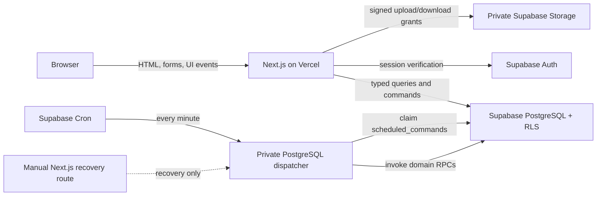

# Jasama Closed-Beta Technical Specification

Status: implementation contract for the approved P0 closed-beta scope.

Authority order:

1. `PRODUCT.md` is the product authority.
2. `DESIGN.md` is the visual and interaction authority.
3. `docs/PRD.md`, `docs/STATE_MACHINES.md`, and `docs/OPEN_DECISIONS.md` define detailed requirements, transitions, and decision status.
4. This document translates those authorities into architecture. It does not approve an open decision.

## 1. Scope and hard boundaries

The system is a mobile-first Indonesian marketplace for local and digital services. It supports public discovery, Pemesan requests, Mitra listings and offers, contextual messaging, orders, delivery/proof, revisions, cancellation, reports, disputes, reviews, moderation, and in-app notifications.

The closed beta has these non-negotiable boundaries:

- Payment is a simulated workflow. No real charge, capture, refund, settlement, payout, bank destination, or provider credential exists.
- No government ID, face image, identity-comparison media, or document-derived identity data may be requested, uploaded, stored, logged, or displayed.
- Closed-beta trust wording is `Profil Mitra diperiksa`; `Identitas terverifikasi` is disabled.
- There is no payment-protection, guaranteed-refund, guarantee, 24-hour-support, ranking, partner, usage-count, or performance-evidence claim without real supporting capability and data.
- Production excludes every record marked `is_demo`.
- P1 and P2 decisions remain disabled. They cannot become active through a default, feature flag, administrative action, or undocumented implementation choice.

## 2. Binding stack

- Next.js App Router with TypeScript strict mode.
- React Server Components by default; Client Components only for browser interaction or local ephemeral state.
- Tailwind CSS implementing the tokens and component rules in `DESIGN.md`.
- Supabase PostgreSQL, Auth, Storage, generated database types, and SQL migrations.
- GitHub as source control, Vercel as web runtime, and pnpm as package manager.

No ORM is proposed. PostgreSQL constraints, row-level security, generated Supabase types, SQL functions, and small typed repositories are sufficient. Reconsider an ORM only if repeated, measured query-maintenance problems cannot be solved by database views/functions and generated types.

## 3. Runtime architecture



### Browser responsibilities

- Render server output; manage menus, sheets, tabs, optimistic affordances, local form state, and accessible live feedback.
- Submit typed inputs and an idempotency key for retryable commands.
- Upload only through short-lived, object-scoped signed grants.
- Never decide authorization, state transitions, prices, revision allowances, visibility, moderation outcomes, or file access.
- Never receive a service-role key, administrative permission map, private address before its release condition, or unrestricted storage URL.

### Server responsibilities

- Verify the Supabase session and resolve the base profile, optional Mitra capability, restrictions, and scoped administrator permissions.
- Validate all untrusted inputs at the boundary.
- Execute reads through least-privilege queries and mutations through domain-specific SQL functions/transactions.
- Derive actors, prices, current terms version, and transition source state from trusted storage rather than browser input.
- Issue short-lived upload/download grants after ownership, order-context, type, size, and state checks.
- Append audit and outbox records in the same transaction as binding changes.
- Keep service-role operations in server-only modules and reserve them for narrowly defined privileged jobs or administration.

## 4. Authentication, capabilities, and authorization

`auth.users` represents authentication only. `profiles` is the application account. Every normal account can act as Pemesan. A `mitra_profiles` row adds Mitra capability; it does not replace the base profile. Administrator authority comes only from active `admin_permission_assignments`.

Schema naming is strict: every `mitra_profile_id` references `mitra_profiles(id)`. When authorization needs the underlying account, it follows `mitra_profiles.profile_id → profiles(id)`; participant rows name that base account `profile_id`.

There is no `users.role` field. Authorization is evaluated in this order:

1. valid session;
2. active base profile and applicable account restrictions;
3. ownership or contextual participation;
4. Mitra capability and onboarding eligibility where required;
5. exact administrator permission for an administrative command;
6. object state and cross-machine preconditions.

Self-granting permissions is forbidden. A JWT issue time, token refresh, or ordinary session age is not proof of reauthentication. Until a verified step-up mechanism is implemented, ordinary scoped moderation may operate, but permanent bans, high-risk permission grants, restricted-evidence export, financial remedies, and production-environment changes have no callable command or grant. This safety gate does not approve the open P1 MFA/reauthentication decision.

The first administrator assignment uses deployment-controlled provisioning, never self-grant. The target Auth account and active, non-demo `profiles` row must already exist. A reviewed migration/provisioning owner inserts the exact approved permission set with `grant_source='provisioning'`, no grantor, and a required change reference. The operation is idempotent for the exact target/set and rejects expansion under the same reference. It has no application UI, runtime command, administrator command, or public API and appends audit events with actor kind `system_provisioning`. The same path is reserved for controlled recovery.

Contact verification, closed-beta Mitra review, and future identity verification are separate domains. Only contact verification and the closed-beta review exist. Future identity verification has no table, endpoint, bucket, feature flag, or copy path.

## 5. Recommended route groups

Route groups are organizational and do not change public URLs.

```text
app/
  (public)/                 homepage, browse, Jasa/Mitra detail, privacy-minimized Permintaan
  (auth)/                   sign-in, registration, callback, recovery
  (account)/                profile, favorites, notifications, settings
  (pemesan)/                requests, offers received, orders, reviews
  (mitra)/                  onboarding, Jasa, eligible requests, offers, work
  (shared)/                 contextual message and order views
  (admin)/                  review and moderation queues by permission
  api/internal/jobs/        manually authenticated recovery invocation only
  api/storage/              signed upload/download grants
```

Use Server Components for page reads and initial state. Use Client Components only where the user must interact without a navigation round trip, such as a filter sheet, combobox, attachment queue, or confirmation dialog. URL search parameters remain the durable source for browse query/filter state.

## 6. Command and query boundaries

- **Server Actions:** same-origin form and UI mutations that benefit from progressive enhancement and server revalidation.
- **Route Handlers:** Auth callback, signed storage grants, scheduled-job invocation, and any future external webhook. There is no payment webhook in closed beta.
- **Database functions/RPC:** atomic multi-row or cross-machine commands, implemented as narrowly scoped functions with a fixed `search_path`, explicit authorization, row locks, constraints, audit, and outbox writes.
- **Server query modules:** read-only, typed projections for Server Components. Public reads use explicit safe projections, never broad base-table selection.

There is no generic `setStatus(machine, state)` API. Each product command expresses intent; the database verifies the exact source/destination pair against the approved machine. `docs/API_EVENTS_AND_JOBS.md` is the command/event contract.

Messaging is contextual under OD-16. A thread belongs to exactly one of: an explicit-intent Jasa inquiry, Permintaan, Penawaran, Pesanan, Report, or Dispute. A Penawaran uses its own dedicated Penawaran thread; it does not silently reuse the parent Permintaan thread. When a context converts, the original thread remains owned by its original context and an explicitly linked successor thread is created with newly authorized participants. There is no user-to-user direct-message context.

## 7. Validation and error contract

Boundary schemas reject unknown keys and validate:

- UUIDs and object ownership;
- bounded Indonesian text and normalized slugs;
- integer rupiah values and `IDR`;
- IANA timezone names;
- category/type combinations and local/digital fields;
- file MIME, extension, byte size, count, and contextual purpose;
- idempotency and correlation identifiers;
- terms/version expectations for binding actions.

Errors use stable codes, safe Indonesian messages, and a correlation ID. Required families are `AUTH_REQUIRED`, `FORBIDDEN`, `ACCOUNT_RESTRICTED`, `NOT_FOUND`, `VALIDATION_FAILED`, `STALE_VERSION`, `INVALID_TRANSITION`, `CONFLICT`, `IDEMPOTENCY_CONFLICT`, `RATE_LIMITED`, `FILE_REJECTED`, and `INTERNAL_ERROR`. Internal details, SQL text, storage paths, private moderation notes, and other users' identifiers are never exposed.

## 8. Data, time, money, and immutability

- Primary keys are UUIDs. Instants are `timestamptz` in UTC.
- User-facing scheduling stores an IANA timezone alongside the relevant deadline basis. Display follows Indonesian formatting and the applicable zone.
- Money is a non-negative PostgreSQL `bigint` representing whole Indonesian rupiah, with `currency = 'IDR'`. Floating-point and mixed major/minor-unit conventions are forbidden.
- Commercial terms use immutable, versioned `pesanan_commercial_snapshots`. One Pesanan retains every version; `pesanan.terms_version` identifies its current pending/accepted version. Changed terms insert a new snapshot and never overwrite an old payload. Later listing/offer/category/tag edits cannot alter an order's category, tags, source versions, or terms.
- Binding histories and security/audit records are append-only. Corrections are new events/versions, not in-place rewriting.
- `jsonb` is allowed only for documented extensible metadata that is not core workflow state, authorization, money, deadlines, ownership, commercial terms, or searchable policy data.

## 9. Files and Storage

All user uploads use private buckets separated by purpose:

- `jasa-media`: portfolio/listing media approved for public display through derived public renditions.
- `message-attachments`: contextual thread files.
- `delivery-files`: digital deliverables.
- `local-proof`: local completion proof.
- `report-evidence` and `dispute-evidence`: restricted trust-and-safety evidence.

The server grants an object path scoped to the actor and parent object. The limit is 10 MB per file and five files per message or submission; five is a count limit, not a file-type limit. Direct upload permits exactly JPEG (`image/jpeg`), PNG (`image/png`), PDF (`application/pdf`), TXT (`text/plain`), CSV (`text/csv`), DOCX (`application/vnd.openxmlformats-officedocument.wordprocessingml.document`), XLSX (`application/vnd.openxmlformats-officedocument.spreadsheetml.sheet`), and PPTX (`application/vnd.openxmlformats-officedocument.presentationml.presentation`). SVG, HTML, executable, script, archive, macro-enabled Office, password-protected, and signature/MIME/extension-mismatched files are rejected.

The allowlist is the approved target, not an operational claim: PDF, DOCX, XLSX, and PPTX remain disabled until the required content validator can reject unsupported, macro-enabled, encrypted, and password-protected content.

The truthful closed-beta attachment lifecycle is `pending_upload → uploaded → validating → validated`, with `quarantined` or `rejected` as failure/safety outcomes. Validation covers byte count, file signature, MIME, extension, checksum, allowlist, and per-message/submission count. Malware scanning is a disabled future extension point until a scanner is selected and operational; `validated` must not be described as malware-scanned.

Upload grants store untrusted declared MIME/extension/byte size. Pending and uploaded rows may have no SHA-256. Finalization derives actual MIME, signature, extension, byte size, and SHA-256 server-side; only a row with every required derived value may become `validated`.

Large audio/video is represented as an access-controlled HTTPS link attached to an immutable delivery version. The server validates URL shape but never fetches the target. The UI identifies third-party hosting and does not guarantee availability. Downloads of direct-upload files use expiring signed URLs after a fresh authorization check.

There is deliberately no identity-document bucket. Object names and metadata must not invite government-ID uploads. Evidence retention duration is unresolved P2; until approved, files are retained under an operational legal hold/deletion procedure and cannot be advertised as having a fixed duration.

## 10. Concurrency and consistency

Binding commands use database transactions and lock the aggregate roots they change. Required invariants include:

- one accepted Penawaran per Permintaan and one order per accepted offer;
- Penawaran replacement terminates the old aggregate as `replaced` and creates a new linked aggregate/version/thread; it never reactivates or rewrites the old link;
- accepted commercial version/snapshot written once;
- competing offers closed in the same acceptance transaction;
- current Jasa terms version rechecked during confirmation;
- work cannot start before required mock payment succeeds;
- delivery/proof/revision/cancellation/dispute/review commands verify order and sibling-machine state;
- only one review per order/reviewer subject and only the approved seven-day edit window;
- restrictions do not silently abandon active orders;
- event, audit, and scheduled-command rows commit with the state transition.

Idempotency is `(actor-or-job scope, command name, idempotency key)` with an input fingerprint and stored result. Reuse with different input fails. Cross-machine processing uses a correlation ID. `outbox_event_deliveries` gives every `(event_id, consumer_name)` independent claim, retry, success, and dead-letter state; the parent event is fully processed only after all required consumers succeed. Workers claim due rows with `FOR UPDATE SKIP LOCKED`.

## 11. Background jobs and OD-29

`scheduled_commands` is the durable clock. Supabase Cron is the single primary dispatcher. It invokes a private database function once per minute; that function claims a small bounded batch with `FOR UPDATE SKIP LOCKED` and invokes the same domain command used interactively. Run history, backlog age, retry-budget exhaustion, and terminal failures are monitored and alerted. Vercel is not a second primary dispatcher; a manually authenticated server-side invocation may exist only for recovery.

For an existing-Jasa order:

1. confirmation request stores `requested_at`, the applicable IANA timezone, `reminder_due_at = requested_at + 12 hours`, and `timeout_due_at = requested_at + 24 hours`;
2. reminder and timeout rows have deterministic idempotency keys;
3. the 12-hour job no-ops if the order is no longer awaiting confirmation or its terms version is stale;
4. the 24-hour job locks the order, repeats those checks, and performs the approved cancellation transition exactly once;
5. attempts, outcome, correlation ID, terms version, and audit event are retained.

“After 12/24 hours” means the first dispatcher run at or after the stored UTC deadline. Clock calculations are duration-based and all deadlines are stored as UTC `timestamptz`. Surabaya local orders use `Asia/Jakarta`. Digital orders default to the Pemesan profile timezone, may use an explicitly agreed valid IANA timezone, and snapshot that zone on the Pesanan. Scheduler availability and alerting are release-critical.

## 12. Mock-payment kill switches

The codebase contains no real payment adapter. Mock payment can run only when all controls agree:

- deployment environment is `local`, `preview`, or `staging_closed_beta`;
- server environment explicitly sets `PAYMENT_MODE=mock`;
- a server-start/build assertion rejects `PAYMENT_MODE=mock` when `APP_ENV=production`;
- the database environment singleton rejects mock-payment inserts/updates in production;
- the command requires an authorized closed-beta participant or test administrator;
- the UI displays a persistent simulation notice;
- mock records have no provider transaction, card, bank, refund, settlement, or payout fields.

Production keeps payment commands disabled. A future real-payment design requires approval of OD-04, OD-05, OD-08, and OD-32 plus a separate security/finance review.

## 13. Demo-data containment

Development/staging may contain realistic synthetic records only when the base profile is marked `is_demo = true`. Marker-bearing descendants inherit `is_demo=true`; pure joins/history inherit demo classification through their parent FK. Database production guards reject demo profiles and either kind of descendant, and production queries explicitly filter them as defense in depth. Import and deployment validation fail if any demo account or row is found in production.

`app_environment` is deployment-controlled configuration, not product administration. It has no ordinary administrator UI or runtime user command and changes only through reviewed provisioning or migration. Production permanently forces `demo_allowed=false` and `mock_payment_allowed=false`.

Per-object demo labels appear only when real and demo data are intentionally mixed. No environment may fabricate testimonials, partners, rankings, usage counts, or performance evidence.

## 13A. Approved public media

Original uploads remain private. Public Jasa cards/details, portfolio previews, and Mitra avatars use generated `media_renditions` stored in a separate approved-derivative bucket. A rendition is tied to its source attachment and the exact approved Jasa version or Mitra review. Replacement creates a new rendition row and URL; revocation removes public eligibility, triggers cache purge, and falls back to an approved placeholder or no image. Message, delivery, proof, report, dispute, and original-source objects can never enter the public bucket.

## 14. Observability and operations

- Structured server logs contain timestamp, environment, route/command, safe actor hash, object type/id, correlation ID, idempotency key hash, duration, outcome, and stable error code.
- Logs exclude message bodies, addresses, file contents/URLs, tokens, credentials, commercial free text, and moderation evidence.
- Security and binding activity is recorded in append-only `audit_events`; business integration uses `outbox_events`.
- Alerts cover job backlog/age, repeated invalid transitions, authorization failures, storage rejection spikes, outbox retries, production demo guard violations, and any attempt to enable mock payment in production.
- Backups, restore drills, migration rollback/forward-fix procedure, key rotation, and administrator access review are release controls.

## 15. Accessibility, localization, and performance

Server-render meaningful content and native controls first. Preserve keyboard operation, 3px/2px focus indicators, 44×44 targets, 320px reflow, 200% zoom, reduced motion, labels, error recovery, and status text independent of color. Indonesian is the primary interface language. Money, date, and zone display follow `DESIGN.md`.

Images use constrained renditions, responsive sizes, explicit dimensions, and lazy loading outside the initial viewport. Public browse queries are paginated and indexed. Do not add client JavaScript for server-renderable content or a dependency for native browser/CSS/database behavior.

## 16. Proposed dependencies

No package is installed by this specification.

| Dependency | Purpose and reason |
|---|---|
| `next`, `react`, `react-dom` | Binding web runtime and component model. |
| `typescript` | Strict static checking. |
| `tailwindcss` and its required build adapter | Binding design-system implementation. |
| `@supabase/supabase-js` | Auth, database, Storage, and generated-type client. |
| `@supabase/ssr` | Supported server/browser session-cookie integration. |
| `zod` | Runtime validation at untrusted command and environment boundaries; TypeScript alone cannot validate runtime data. |
| `vitest` | Fast unit/contract tests for pure domain and validation logic. |
| `@testing-library/react`, `@testing-library/jest-dom` | User-facing component behavior without implementation coupling. |
| `playwright`, `@axe-core/playwright` | Cross-browser journeys and automated accessibility checks. |
| Supabase CLI | Local database, generated types, migration checks, and pgTAP execution. |

Use the platform for cron, SQL migrations, constraints, signed URLs, image handling, and logging before considering additional libraries. Material Symbols Sharp is loaded as the single approved icon asset family, not through a component abstraction dependency.

## 17. Remaining technical questions and P0 dependencies

These do not reopen product decisions:

- Provision and monitor the Supabase Cron one-minute dispatcher and its manually authenticated recovery path.
- Establish temporary operational retention/legal-hold instructions for private evidence until the P2 exact-retention decisions are approved.
- Select and integrate a malware scanner before any UI or policy claims malware scanning; the closed beta performs validation only.
- Design and verify a real reauthentication/step-up mechanism before enabling the gated high-risk actions. JWT issue time and refresh are insufficient.
- Select and implement the phone-verification mechanism/provider before the onboarding phase; no phone-verification claim or gate is operational before integration tests pass.
- Select and implement an Office/PDF content validator that detects unsupported, macro-enabled, encrypted, and password-protected content before PDF, DOCX, XLSX, or PPTX uploads are enabled. MIME/signature checks alone do not satisfy this blocker.

None of these permits real money, government-ID collection, or P1/P2 product behavior.
